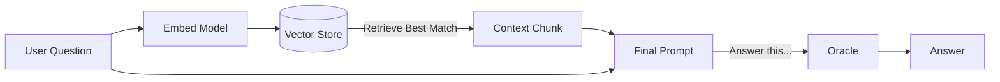

# 📜 Level 3 Grimoire: The Synthesis (RAG)

You have become a Weaver. You now have the power to feed the Oracle secret knowledge.

## 🧬 Concept 1: The RAG Loop
Retrieval Augmented Generation is a simple 3-step dance:
1.  **Retrieve**: Convert user question to vector -> Search Database -> Get relevant Text Chunk.
2.  **Augment**: Paste that Text Chunk into the prompt.
3.  **Generate**: Ask the LLM to answer using *only* that chunk.

## 💉 Concept 2: Context Injection
The LLM has a **Context Window** (e.g., 4096 tokens). It's like short-term memory.
- We "inject" our retrieved knowledge into this window.
- **Prompt Engineering**: We wrap it in instructions like *"Answer based ONLY on the context below"*.
- This reduces **Hallucination** (making things up) because the answer is right there in the prompt.

## 🕸️ The Architecture

---

**Next Level Info:**

- But what if the retrieval is wrong? Or the LLM ignores it?
- In Level 4, we become **Critics** and add **Evaluation** logic.
